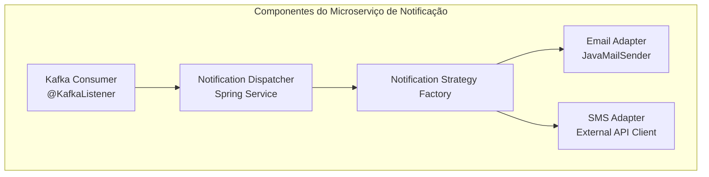

# 🚀 Sistema de Notificações Assíncronas (Event-Driven)

Este projeto demonstra uma arquitetura moderna de microserviços para processamento de notificações em alta escala, utilizando o **Spring Boot 4.0.5** e as capacidades nativas do **Java 21**.

## 🛠 Tecnologias e Conceitos
* **Java 21**: Foco total em **Virtual Threads** (Project Loom) para escalabilidade massiva com baixo overhead de memória.
* **Spring Boot 4.0.5**: Utilização da versão mais recente do framework para gerenciamento de dependências e auto-configuração otimizada.
* **Apache Kafka**: Broker de mensagens para garantir o desacoplamento e a entrega resiliente.
* **Redis**: Cache de baixa latência para controle de estado e idempotência.
* **Lombok**: Produtividade no desenvolvimento através da redução de boilerplate.
* **Docker & Docker Compose**: Padronização do ambiente de execução e infraestrutura.

---

## 🏗 Arquitetura do Sistema

O fluxo de dados foi desenhado para ser totalmente assíncrono:
1.  **API (Producer)**: Recebe a notificação e delega a persistência ao Kafka.
2.  **Broker (Kafka)**: Armazena o evento de forma durável.
3.  **Worker (Consumer)**: Processa a lógica de negócio e sincroniza o status final no **Redis**.

---

## 🚦 Como Executar no openSUSE

### 1. Pré-requisitos
* Docker / Docker Compose.
* JDK 21.
* Maven (Wrapper `./mvnw` incluso).

### 2. Infraestrutura
Inicie os serviços de suporte (Kafka e Redis):
```bash
docker-compose up -d
```

## Arquitetura do Microserviço de Notificação

Este projeto utiliza o padrão C4 Model para descrever a infraestrutura.


